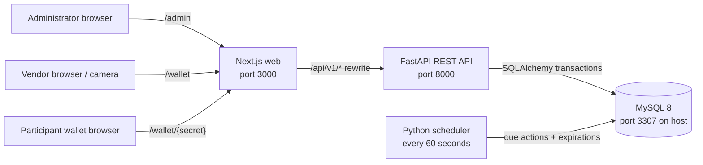
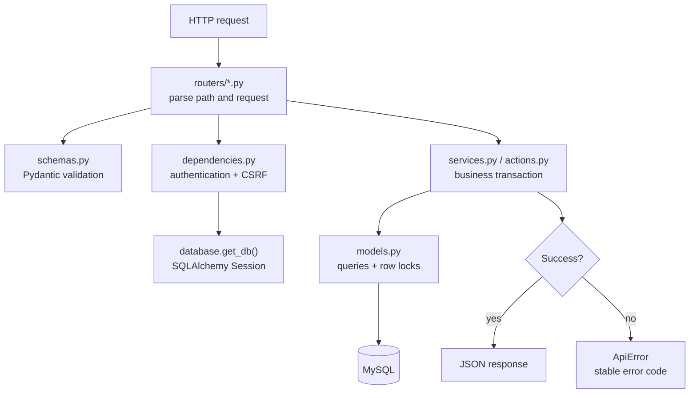
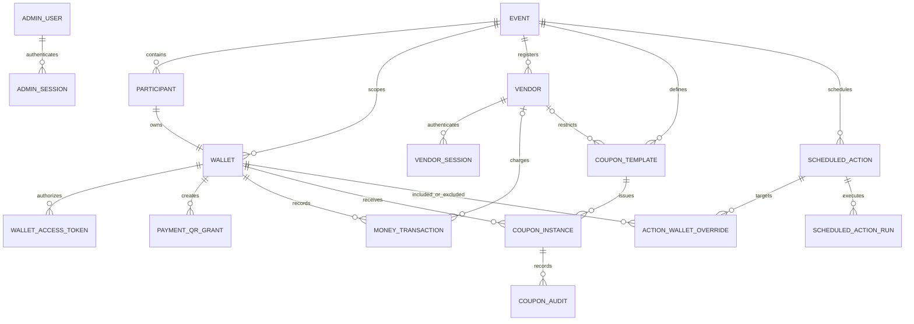
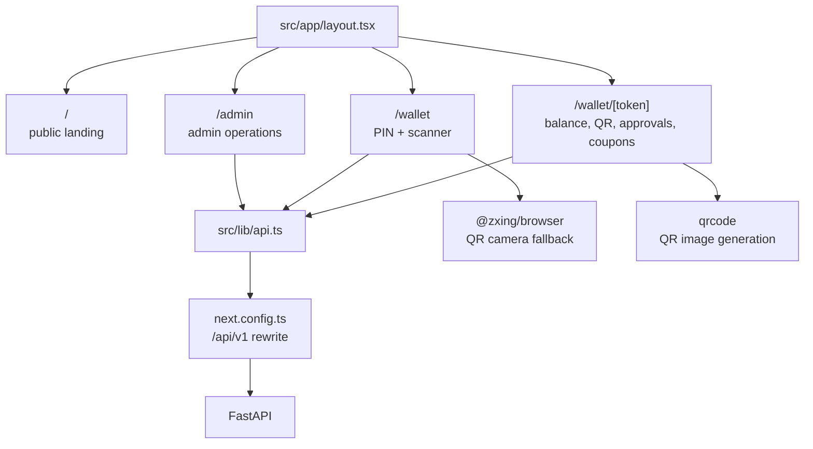

# Event Manager Service — Developer Guide

This guide is the quickest way to understand, run, and extend the project. It is organized around the two application halves:

- **Backend:** FastAPI, SQLAlchemy, Alembic, MySQL, and the scheduler.
- **Frontend:** Next.js App Router, React, TypeScript, and Tailwind CSS.

For a shorter installation overview, see [`README.md`](README.md). API documentation is available from a running backend at [http://localhost:8000/api/docs](http://localhost:8000/api/docs).

## 1. System at a glance



There is one deployable web application, one API, one database, and one background process. The frontend never talks directly to MySQL. Both the API and scheduler use the same backend code and SQLAlchemy models.

### Main user surfaces

| User | Browser route | API group | Authentication |
|---|---|---|---|
| Administrator | `/admin` | `/api/v1/auth`, `/api/v1/admin` | Email/password, HTTP-only session cookie, CSRF token |
| Vendor | `/wallet` | `/api/v1/vendor` | Event code + six-digit PIN, HTTP-only session cookie, CSRF token |
| Participant | `/wallet/{access_token}` | `/api/v1/participant` | Revocable high-entropy bearer link |

## 2. Project structure

```text
event-manager-service/
├── backend/
│   ├── alembic/                 # Database migration environment and revisions
│   │   └── versions/0001_initial.py
│   ├── app/
│   │   ├── routers/             # HTTP endpoints grouped by audience
│   │   │   ├── admin.py
│   │   │   ├── auth.py
│   │   │   ├── participant.py
│   │   │   └── vendor.py
│   │   ├── actions.py           # Scheduled/bulk action execution
│   │   ├── cli.py               # create-admin and seed-demo commands
│   │   ├── config.py            # Environment-backed settings
│   │   ├── database.py          # Engine, session factory, Base, get_db
│   │   ├── dependencies.py      # Authentication and CSRF dependencies
│   │   ├── errors.py            # Stable JSON API errors
│   │   ├── jobs.py              # Scheduler loop and MySQL advisory lock
│   │   ├── main.py              # FastAPI assembly and health endpoint
│   │   ├── models.py            # SQLAlchemy database models and enums
│   │   ├── schemas.py           # Pydantic request/response validation
│   │   ├── security.py          # Argon2, hashes, HMACs, opaque tokens
│   │   └── services.py          # Core wallet/payment/coupon business logic
│   ├── tests/                   # Pytest tests
│   ├── Dockerfile
│   ├── requirements.txt
│   └── pyproject.toml
├── frontend/
│   ├── e2e/                     # Playwright browser journeys
│   ├── src/
│   │   ├── app/
│   │   │   ├── admin/           # Administrator UI
│   │   │   ├── wallet/          # Vendor UI and participant token route
│   │   │   ├── globals.css
│   │   │   ├── layout.tsx
│   │   │   └── page.tsx         # Public landing page
│   │   ├── components/
│   │   │   ├── admin/           # Focused admin panels, shared types, and form UI
│   │   │   └── Shell.tsx
│   │   ├── lib/api.ts           # Shared HTTP client and money formatter
│   │   └── test/setup.ts
│   ├── Dockerfile
│   ├── next.config.ts            # /api/v1 proxy to FastAPI
│   ├── package.json
│   └── pnpm-lock.yaml
├── .env.example
├── docker-compose.yml
├── Makefile
└── README.md
```

## 3. Docker: build and run

### First-time setup

From the project root:

Windows PowerShell:

```powershell
Copy-Item .env.example .env
```

Linux/macOS:

```bash
cp .env.example .env
```

Edit `.env` and replace at least:

```dotenv
MYSQL_PASSWORD=use-a-strong-local-password
MYSQL_ROOT_PASSWORD=use-a-different-strong-password
APP_SECRET_KEY=replace-with-at-least-32-random-characters
```

Generate an application secret without inventing one manually.

Windows PowerShell:

```powershell
python -c "import secrets; print(secrets.token_urlsafe(48))"
```

Linux/macOS:

```bash
python3 -c 'import secrets; print(secrets.token_urlsafe(48))'
```

On Linux, verify that Docker Engine and the Compose plugin are available:

```bash
docker --version
docker compose version
```

If Docker is configured for root-only access, prefix Docker commands with `sudo` or configure non-root Docker access for your user.

### Build and start everything

The following Docker commands are identical in PowerShell, bash, and zsh:

```bash
docker compose up --build -d
docker compose ps
```

Open:

- Web application: [http://localhost:3000](http://localhost:3000)
- FastAPI Swagger UI: [http://localhost:8000/api/docs](http://localhost:8000/api/docs)
- API health check: [http://localhost:8000/health](http://localhost:8000/health)
- MySQL from the host: `127.0.0.1:3307`

The API container runs `alembic upgrade head` before starting Uvicorn, so an empty database is migrated automatically.

### Create the first administrator

```bash
docker compose run --rm api python -m app.cli create-admin
```

The command prompts for credentials. Avoid putting a production password directly in shell history.

Optional demo event:

```bash
docker compose run --rm api python -m app.cli seed-demo
```

### Everyday Docker commands

```bash
# Follow all logs
docker compose logs -f

# Follow one service
docker compose logs -f api
docker compose logs -f scheduler
docker compose logs -f web

# Restart one service after configuration changes
docker compose restart api

# Rebuild only the changed application
docker compose up --build -d api
docker compose up --build -d web

# Apply migrations explicitly
docker compose run --rm api alembic upgrade head

# Run one scheduler pass immediately
docker compose run --rm scheduler python -m app.jobs

# Open a MySQL shell
docker compose exec mysql mysql -u event_manager -p event_manager

# Stop containers but keep database data
docker compose down
```

> `docker compose down -v` also deletes the MySQL volume and all application data. Use it only when intentionally resetting a development database.

### Development mode: edit without rebuilding

The base Compose file runs production-style images. For active development, merge it with `docker-compose.dev.yml`:

```bash
docker compose -f docker-compose.yml -f docker-compose.dev.yml up --build
```

Development mode provides:

- A bind-mounted `backend/` directory and Uvicorn `--reload` for FastAPI.
- A bind-mounted `frontend/` directory and the Next.js development server with hot reload.
- A scheduler process watched by `watchfiles`, so Python changes restart it automatically.
- Named volumes for frontend dependencies and `.next` output, keeping large generated directories out of the host project. The locked frontend dependencies are synchronized whenever `web` starts.
- The same MySQL service and persistent `mysql-data` volume as the base stack.

After the first build, ordinary changes to Python, TypeScript, React components, CSS, or tests do not require rebuilding. Restart `web` after changing `package.json` or `pnpm-lock.yaml`; its startup command updates the dependency volume. Rebuild after changing `requirements.txt` or either Dockerfile.

Useful development commands:

```bash
# Start in the foreground; Ctrl+C stops the processes
docker compose -f docker-compose.yml -f docker-compose.dev.yml up --build

# Start in the background
docker compose -f docker-compose.yml -f docker-compose.dev.yml up --build -d

# Follow application logs
docker compose -f docker-compose.yml -f docker-compose.dev.yml logs -f api web scheduler

# Stop containers but preserve MySQL and dependency volumes
docker compose -f docker-compose.yml -f docker-compose.dev.yml down

# Restart the frontend and synchronize changed dependencies
docker compose -f docker-compose.yml -f docker-compose.dev.yml restart web

# Rebuild the API and scheduler after changing Python dependencies
docker compose -f docker-compose.yml -f docker-compose.dev.yml up --build -d api scheduler
```

Always include both `-f` arguments when managing the development stack. A plain `docker compose down` reads only the base file and may not remove override-specific resources.

### Container relationships

| Compose service | Source | Responsibility | Persistent data |
|---|---|---|---|
| `web` | `frontend/Dockerfile` | Next.js pages and API proxy | None |
| `api` | `backend/Dockerfile` | Migrations, REST API, OpenAPI | None |
| `scheduler` | `backend/Dockerfile` | Expirations and scheduled actions | None |
| `mysql` | `mysql:8.4` | Application data and locking | `mysql-data` volume |

---

# Backend

## 4. Backend request lifecycle



Keep routers thin. Validation belongs in Pydantic schemas, authentication in dependencies, and reusable transactional behavior in services.

## 5. Database model relationships



Important invariants:

- A participant has exactly one wallet per event.
- Balances are stored as integer minor units: `1050` means `€10.50` for EUR.
- Every wallet, vendor, transaction, coupon, and action is explicitly event-scoped.
- Approved ledger history is preserved. Reversals create compensating records.
- Pending payments reserve funds but do not reduce `Wallet.balance_minor` until approval.
- Wallet access tokens and session tokens are stored as hashes, never as plaintext.
- Admins open wallets with separate short-lived preview tokens; previews do not rotate participant links.
- Payment QR grants are short-lived and consumed atomically.

## 6. Payment flow

```mermaid
sequenceDiagram
    participant Participant
    vendor Vendor
    frontend Next.js
    api FastAPI
    db MySQL

    Participant->>Next.js: Generate payment QR
    Next.js->>FastAPI: POST participant/payment-qr
    FastAPI->>MySQL: Revoke old grant, store token hash + expiry
    FastAPI-->>Next.js: Raw one-time token + TTL
    Vendor->>Next.js: Scan QR and enter amount
    Next.js->>FastAPI: POST vendor/payments + idempotency key
    FastAPI->>MySQL: Lock wallet and QR grant
    FastAPI->>MySQL: Check available balance and consume grant
    alt Approval required
        FastAPI->>MySQL: Create pending transaction
        Participant->>FastAPI: Approve or reject
        FastAPI->>MySQL: Lock wallet + transaction and settle
    else Immediate settlement
        FastAPI->>MySQL: Debit wallet and create approved transaction
    end
```

## 7. Backend files and libraries

### SQLAlchemy models — `backend/app/models.py`

Use models for persisted state and relationships. Common enums include:

- `EventStatus`: `draft`, `active`, `archived`
- `EventMode`: `money`, `coupons`, `both`
- `TransactionStatus`: `pending`, `approved`, `rejected`, `cancelled`, `reversed`
- `TransactionType`: initial/admin credits and debits, vendor debit, reversal
- `CouponStatus`: `available`, `disabled`, `redeemed`, `removed`
- `ActionType` and `ScheduleType` for automation

Typical read:

```python
from sqlalchemy import select
from app.models import Wallet

wallet = db.scalar(
    select(Wallet).where(
        Wallet.id == wallet_id,
        Wallet.event_id == event_id,
    )
)
```

For balance-changing operations, lock the row inside the same transaction:

```python
wallet = db.scalar(
    select(Wallet)
    .where(Wallet.id == wallet_id, Wallet.event_id == event_id)
    .with_for_update()
)
```

### Pydantic schemas — `backend/app/schemas.py`

Request bodies use `BaseModel` subclasses such as `EventCreate`, `ParticipantCreate`, `PaymentCreate`, and `ActionCreate`. Put field lengths, numeric ranges, regex patterns, and normalization here so invalid data never reaches business logic.

### FastAPI dependencies — `backend/app/dependencies.py`

Useful route guards:

| Dependency | Use it for |
|---|---|
| `require_admin` | Read-only authenticated administrator endpoints |
| `require_admin_csrf` | Administrator mutations |
| `require_vendor` | Read-only vendor endpoints |
| `require_vendor_csrf` | Vendor mutations |
| `get_db` | One SQLAlchemy session per request |

Example endpoint:

```python
@router.post("/events/{event_id}/example")
def example(
    event_id: int,
    admin: AdminUser = Depends(require_admin_csrf),
    db: Session = Depends(get_db),
) -> dict:
    event = get_event(db, event_id, lock=True)
    # Perform one event-scoped mutation.
    db.commit()
    return {"event_id": event.id, "actor": f"admin:{admin.id}"}
```

### Core services — `backend/app/services.py`

These are the most useful functions to reuse rather than duplicating behavior:

| Function | Purpose |
|---|---|
| `event_supports(event, system)` | Checks whether an event supports money or coupons |
| `create_participant_with_wallet(...)` | Atomically creates a participant, wallet, access link, and initial credit |
| `rotate_wallet_token(db, wallet)` | Revokes existing wallet links and returns a new raw token once |
| `wallet_for_access_token(...)` | Resolves a participant bearer link, optionally with a row lock |
| `reserved_minor(db, wallet_id)` | Calculates unexpired pending money reservations |
| `create_payment_qr(db, wallet)` | Invalidates old grants and creates a short-lived QR token |
| `resolve_payment_target(...)` | Resolves an event-scoped QR or participant-code lookup |
| `create_vendor_payment(...)` | Handles replay prevention, idempotency, balance checks, and settlement |
| `decide_payment(...)` | Atomically approves/rejects a pending payment |
| `issue_coupons(...)` | Issues only missing active coupons to selected wallets |
| `validate_participant_csv(content)` | Validates the complete CSV before any rows are imported |
| `reference(prefix)` | Generates readable unique audit references |

### Security helpers — `backend/app/security.py`

- `hash_password` / `verify_password`: Argon2id for administrator passwords and vendor PINs.
- `token_hash`: SHA-256 for random bearer/session tokens.
- `keyed_lookup`: HMAC lookup that avoids searching directly by a PIN.
- `coupon_token` / `coupon_id_from_token`: signed opaque coupon payloads.
- `new_token`: cryptographically secure URL-safe random tokens.

Do not log or persist raw passwords, PINs, session tokens, access links, or payment QR values.

### Scheduled actions — `backend/app/actions.py` and `jobs.py`

`jobs.run_due()` obtains the MySQL advisory lock `event-manager-scheduler`, expires pending payments, selects due actions, and calls `execute_action()`. Each action run has an idempotent `run_key`.

To test a single pass on Windows, Linux, or macOS:

```bash
docker compose run --rm scheduler python -m app.jobs
docker compose logs --tail 100 scheduler
```

## 8. Adding backend functionality

### Add a new API endpoint

1. Add or update a request schema in `schemas.py`.
2. Put reusable business behavior in `services.py` or `actions.py`.
3. Add the route to the appropriate audience router.
4. Require the correct authentication/CSRF dependency.
5. Filter every query by `event_id` where the model is event-scoped.
6. Add unit/integration tests and regenerate frontend API types.

### Change the database

1. Update the model in `models.py`.
2. Create an Alembic revision:

   ```bash
   docker compose run --rm api alembic revision --autogenerate -m "describe change"
   ```

3. Read the generated migration carefully; do not assume autogeneration captures data transformations.
4. Apply it:

   ```bash
   docker compose run --rm api alembic upgrade head
   ```

5. Verify downgrade behavior for development, but never downgrade production blindly.

### Backend checks without Docker

Windows PowerShell:

```powershell
cd backend
python -m venv .venv
.venv\Scripts\Activate.ps1
pip install -r requirements.txt
ruff check app tests
mypy app
pytest --cov=app --cov-report=term-missing
```

Linux/macOS:

```bash
cd backend
python3 -m venv .venv
source .venv/bin/activate
python -m pip install -r requirements.txt
ruff check app tests
mypy app
pytest --cov=app --cov-report=term-missing
```

---

# Frontend

## 9. Frontend routing and data flow



The current pages are client components because they hold authentication state, call the API, access the camera, and render QR images.

## 10. Frontend files and libraries

### Shared API client — `frontend/src/lib/api.ts`

Use `api<T>()` for browser requests. It:

- Prefixes `/api/v1`.
- Includes HTTP-only cookies with `credentials: "include"`.
- Adds JSON content headers when appropriate.
- Adds `X-CSRF-Token` when supplied.
- Disables response caching.
- Converts structured API errors into `ApiFailure`.

```typescript
type EventList = { events: Event[] };

const result = await api<EventList>("/admin/events");

await api(
  `/admin/events/${eventId}/vendors`,
  {
    method: "POST",
    body: JSON.stringify({ name: "Coffee stand", pin: "123456" }),
  },
  csrfToken,
);
```

Use `money(minor, currency)` for display. Never divide or format persisted money ad hoc throughout components.

### Main components

| Component/page | Responsibility |
|---|---|
| `src/app/admin/page.tsx` | Login, event selection, participants, vendors, coupons, automation, ledgers |
| `src/app/wallet/page.tsx` | Vendor PIN login, camera scanning, lookup, payment, coupon redemption |
| `src/app/wallet/[token]/page.tsx` | Participant wallet, payment QR, approvals, coupons, activity |
| `src/components/Shell.tsx` | Shared brand and public-page shell |
| `src/app/globals.css` | Tailwind layers and reusable UI classes |

### Important libraries

- **Next.js App Router:** routing, production build, server/API rewrite.
- **React:** local form, request, and flow state.
- **Tailwind CSS:** responsive layout and design tokens.
- **`@zxing/browser`:** camera-based QR decoding in vendor flow.
- **`qrcode`:** turns opaque API payloads into QR data URLs.
- **Lucide React:** accessible interface icons.
- **Vitest + Testing Library:** component and utility tests.
- **Playwright:** real browser journeys on desktop and mobile layouts.
- **`openapi-typescript`:** generates TypeScript types from FastAPI OpenAPI.

## 11. Adding frontend functionality

### Add a page

1. Create `src/app/<route>/page.tsx`.
2. Add `"use client"` only if it needs hooks, browser APIs, camera access, or event handlers.
3. Use the shared `api<T>()` helper rather than direct `fetch`.
4. Use the existing `.card`, `.button`, `.button-secondary`, `.input`, `.label`, and `.badge` classes.
5. Test narrow/mobile layouts because participant and vendor pages are primarily phone workflows.

### Add an authenticated mutation

1. Refresh or obtain the audience CSRF token from `/auth/csrf` or `/vendor/csrf`.
2. Pass it as the third argument to `api()`.
3. Handle `ApiFailure.message` in the visible form state.
4. Refresh the relevant resource after success rather than guessing the final server state.

### Regenerate API types

Start the API, then:

Windows PowerShell, Linux, or macOS:

```bash
cd frontend
pnpm generate:api
```

This reads `http://localhost:8000/api/openapi.json` and writes `src/lib/api.generated.ts`. Commit the generated file whenever the API contract changes.

### Frontend checks

Windows PowerShell, Linux, or macOS:

```bash
cd frontend
corepack enable
pnpm install --frozen-lockfile
pnpm lint
pnpm typecheck
pnpm test
pnpm build
```

Browser tests require Playwright browsers:

Windows/macOS:

```powershell
pnpm exec playwright install chromium
pnpm test:e2e
```

Linux (installs Chromium and required system packages):

```bash
pnpm exec playwright install --with-deps chromium
pnpm test:e2e
```

## 12. Common development recipes

### Watch the API while using the UI

The Docker commands in this section are identical in PowerShell, bash, and zsh.

```bash
docker compose logs -f api web
```

### Inspect a failing scheduler action

```bash
docker compose logs --tail 200 scheduler
docker compose run --rm scheduler python -m app.jobs
```

Then inspect `scheduled_action_runs` in MySQL or the admin Automation screen.

### Reset only application containers

```bash
docker compose down
docker compose up --build -d
```

The `mysql-data` volume remains intact.

### Start with a completely empty local database

```bash
docker compose down -v
docker compose up --build -d
docker compose run --rm api python -m app.cli create-admin
```

This is destructive and should only be used for an intentionally disposable development database.

## 13. Debugging checklist

| Symptom | First checks |
|---|---|
| API stays unhealthy | `docker compose logs api`; verify MySQL health and `DATABASE_URL` |
| Admin/vendor mutation returns 403 | Refresh the matching CSRF endpoint and include `X-CSRF-Token` |
| Vendor login is rejected | Event must be `active`; vendor must be active; verify event code and event-scoped PIN |
| QR lookup fails | Payment QR may be expired/consumed; coupon may be redeemed or vendor-restricted |
| Balance looks too low | Check pending reservations as well as approved transactions |
| Scheduler does nothing | Check action `enabled`, `execute_at`, event scope, run history, and scheduler logs |
| Frontend API calls hit the wrong host | Check `API_INTERNAL_URL` and `NEXT_PUBLIC_API_BASE` |
| Schema mismatch | Run `alembic current`, `alembic heads`, then `alembic upgrade head` |

## 14. Safe development rules

- Scope every database query and API operation to an event.
- Represent all money in integer minor units.
- Use row locks for balance, QR consumption, payment decisions, and coupon redemption.
- Require idempotency keys for retryable money mutations.
- Never change or delete audit history to “fix” a balance; create an adjustment or reversal.
- Never log raw authentication secrets or QR payloads.
- Treat participant wallet URLs as credentials.
- Keep router code small and move reusable behavior into services.
- Add a migration for every persisted schema change.
- Update OpenAPI-derived frontend types and tests when an endpoint changes.
